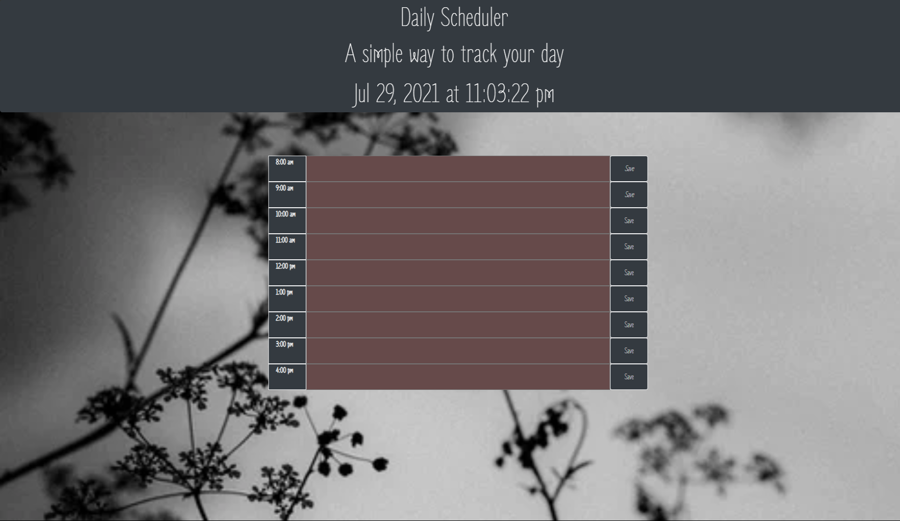

## Scope of assignment
GIVEN I am using a daily planner to create a schedule 
WHEN I open the planner 
THEN the current day is displayed at the top of the calendar X
WHEN I scroll down
THEN I am presented with timeblocks for standard business hours X
WHEN I view the timeblocks for that day
THEN each timeblock is color coded to indicate whether it is in the past, present, or future X
WHEN I click into a timeblock
THEN I can enter an event X
WHEN I click the save button for that timeblock X
THEN the text for that event is saved in local storage X
WHEN I refresh the page
THEN the saved events persist X

## start

Get close to start template style
Build out HTML and link up bootstrap
Basic fluid jumbotron applied 
Adding a container 
I want to do half an hour intervals but for time sake I will do hours 
configure text areas from the bootstrap
finding a way to make time function work, looking back on old classwork. 
worked out how to get the time to display properly - had a p element aroung the span: delete

## further progress
configuring the bootstrap container. Move to version 4, one of my scripts was causing confusion. I need past present and future indicators to link up in the js script.

Events are active, removed the resizing feture and worked out the bootstrap box sizing of the rows/colums and jumbotron.

Most of the code is set up, the color code and local storage are not testing out they way they should - going to work with tutor. Tutor and TA worked out why the color times were not communicating with the colors in css.

notate how moment is used for future projects. Numbers were changed in the id to communicate time.

Fixed container box and font, changed css colors a little bit.

